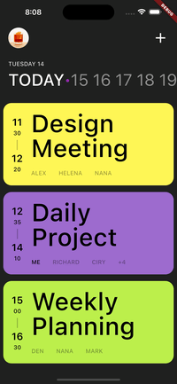
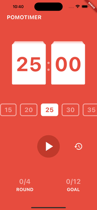
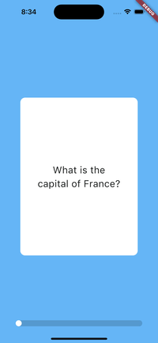

# Nomad Coders Flutter Study
노마드코더의 플러터 스터디에서 진행한 챌린지
- 관련 강의
  - [Flutter로 웹툰 앱 만들기](https://nomadcoders.co/flutter-for-beginners)
  - [틱톡 클론코딩](https://nomadcoders.co/tiktok-clone)
  - [Flutter Animations 마스터클래스](https://nomadcoders.co/flutter-animations-masterclass)

## Skills
- Dart
- Flutter
- MVVM
- Packages
  - [intl](https://pub.dev/packages/intl) : localization을 위한 패키지. DateFormat을 위해 사용.
  - [provider](https://pub.dev/packages/provider) : 상태 관리를 위한 패키지. Pmodoro에서 타이머의 상태 관리에 사용.
  - [http](https://pub.dev/packages/http) : 네트워크 통신을 위한 패키지.
  - [font_awesome_flutter](https://pub.dev/packages/font_awesome_flutter) : FontAwesome 아이콘 사용을 위한 패키지.
  - [flutter_staggered_grid_view](https://pub.dev/packages/flutter_staggered_grid_view) : 다양한 그리드 레이아웃을 제공하는 패키지. twitter 온보딩 화면 중 Interests 화면의 아이템 표시를 위해 사용.
  - [faker](https://pub.dev/packages/faker) : fake 데이터를 제공하는 패키지.
  - [camera](https://pub.dev/packages/camera) : 디바이스의 카메라를 사용하기 위한 패키지.
  - [permission_handler](https://pub.dev/packages/permission_handler) : iOS, Android의 권한 요청을 간편하게 해주는 패키지.
  - [image_picker](https://pub.dev/packages/image_picker) : 이미지 라이브러리에서 이미지를 선택할 수 있게 해주는 패키지.
  - [device_preview](https://pub.dev/packages/device_preview) : 다양한 디바이스에서 UI 확인을 간편하게 해주는 패키지.
  - [go_router](https://pub.dev/packages/go_router) : URL 기반 화면 전환을 간편하게 해주는 패키지.
  - [flutter_riverpod](https://pub.dev/packages/flutter_riverpod) : 상태 관리를 위한 패키지. 
  - [shared_preferences](https://pub.dev/packages/shared_preferences) : 플랫폼의 특정 persistent storage에 간단한 데이터를 저장할 수 있게 해주는 패키지.
  - [firebase_core](https://pub.dev/packages/firebase_core) : Firebase와 연결할 수 있게 해주는 패키지.
  - [firebase_auth](https://pub.dev/packages/firebase_auth) : Firebase의 Authentication을 사용할 수 있게 해주는 패키지. 이메일 로그인, 소셜 로그인 등 지원.
  - [cloud_firestore](https://pub.dev/packages/cloud_firestore) : Firebase의 Firestore를 사용할 수 있게 해주는 패키지. noSQL DB 지원.
  - [firebase_storage](https://pub.dev/packages/firebase_storage) : Firebase의 Storage를 사용할 수 있게 해주는 패키지. 
  - [uuid](https://pub.dev/packages/uuid) : UUID를 만들어주는 패키지.
  - [flutter_animate](https://pub.dev/packages/flutter_animate) : 애니메이션을 간편하게 사용할 수 있게 해주는 패키지.

## Results

| [Scheduler](./scheduler/) | [Pomodoro](./pomodoro/) | [Movie](./movie/) |
| :---: | :---: | :---: |
|  |  |  |

---

| [Twitter 1](./twitter/) | [Twitter 2](./twitter/) |
| :---: | :---: |
|  |  |

---

### [Threads](./threads/)

| Home Screen | Search, Activity Screen |
| :-: | :--: |
|  |  |

| Profile, Settings Screen | Write, Camera Screen |
| :-: | :-: |
|  |  |

---

| [Implicit Animations](/implicit_animations/) | [Explicit Animations](/explicit_animations/) | [Custom Painter](/custom_painter/) |
| :-: | :-: | :-: |
|  |  |  |

| [Flashcard](/flashcards_app/) | [Pal Book](/pal_book/) |
| :-: | :-: |
|  |  |